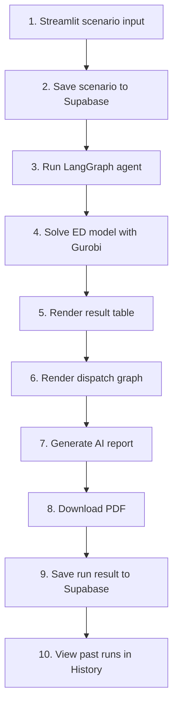

# Data Center Energy Dispatch Agent

Streamlit 기반 데이터센터 경제급전(ED) PoC 애플리케이션입니다. 사용자가 시나리오를 입력하면 Supabase에 저장하고, LangGraph agent가 Gurobi 최적화를 실행한 뒤 결과표, 그래프, AI 분석 보고서, PDF 다운로드를 제공합니다.

## Team

| Name | Role | Responsibility |
| --- | --- | --- |
|  | Agent / Web Integration | Builds the LangGraph agent from the provided ED constraints and deploys the workflow as a Streamlit web app with Supabase, Gurobi, OpenAI reporting, PDF download, and History view |
|  | Strategy / Optimization Contributor | Provides strategy-domain expertise, contributes to constraint design, and supports GitHub-based development updates |
|  | Mechanical Engineering Contributor | Provides mechanical-engineering expertise and supports constraint formulation and technical validation |

## Features

| Area | Description |
| --- | --- |
| Scenario Input | Start row, time steps, GT/SMR/ESS parameters 입력 |
| Supabase Storage | Scenario와 실행 결과 저장 |
| LangGraph Agent | Parsing, formulation, solving, explanation workflow 실행 |
| Optimization | Gurobi 기반 dispatch optimization |
| Results | KPI, dispatch table, TOU summary, dispatch graph 출력 |
| Report | OpenAI 기반 English analysis report 생성 |
| PDF | Graph와 report가 포함된 PDF 다운로드 |
| History | Supabase에 저장된 과거 실행 조회 |

## App Flow



## Local Setup

```bash
python -m venv .venv
source .venv/bin/activate
pip install -r requirements.txt
```

Create `.streamlit/secrets.toml`:

```toml
SUPABASE_URL = "https://your-project.supabase.co"
SUPABASE_ANON_KEY = "your-supabase-publishable-key"
OPENAI_API_KEY = "your-openai-api-key"

GRB_WLSACCESSID = "your-gurobi-wls-access-id"
GRB_WLSSECRET = "your-gurobi-wls-secret"
GRB_LICENSEID = "your-gurobi-license-id"
```

Run locally:

```bash
streamlit run app.py
```

## Supabase Setup

Run the SQL files in the Supabase SQL editor:

| File | Purpose |
| --- | --- |
| `supabase/schema.sql` | Creates `scenarios` and `runs` tables |
| `supabase/policies.sql` | Demo RLS policies for insert/read access |

## Database Tables

| Table | Stored Data |
| --- | --- |
| `scenarios` | Scenario name, memo, input configuration, created timestamp |
| `runs` | Status, KPI metrics, dispatch result table, report text, error message, created timestamp |

PDF files and graph images are generated at runtime for download. They are not stored in Supabase.

## Streamlit Cloud Deployment

1. Push the repository to GitHub.
2. Create a new Streamlit app from `app.py`.
3. Add the same secrets shown above in Streamlit Cloud secrets.
4. Deploy the app and share the Streamlit app URL with teammates.

## Notes

- Gurobi WLS credentials are required for cloud optimization.
- OpenAI API key is required for the full AI-generated report.
- Supabase stores the scenario and run history used by the History tab.
